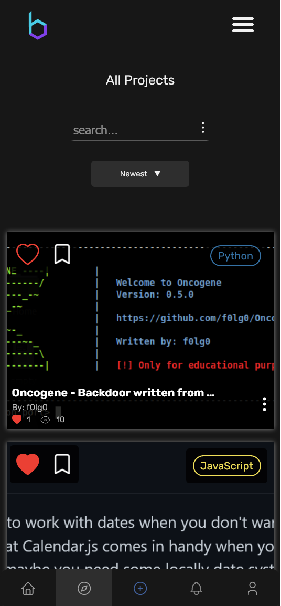

<h1 align="center">devsBunker</h1>
<p align="center">A platform where developers can promote their work for free.</p>

<p align="center">
  
</p>

## About

Devsbunker provides developers a way to share and advertise their work in a free and easy way. While it is mainly designed for software developers, it's certainly not limited to that. Graphic design, 3D modeling, photo editing, and game development are a few examples of valid contributions.

We felt like there was no good place to share your projects whenever you wanted, while making it easy for others to find them.

<p align="center">
  
</p>

## How it works

The project works through a Node.js backend, Vue.js frontend, and MongoDB database. Post and user documents are stored in the database and retrieved by the backend nodejs server, where they are then communicated with the frontend. Document retrieval is done through a GraphQL API and processed by the Vue.js frontend.

Authorization uses JWT tokens: a `refresh_token` used to get `access_token`(s) which are the main source of authentication. Any backend call that involves sensitive information requires an `access_token`. The `refresh_token` is stored as an HTTP-only cookie and `access_token`(s) are stored directly in the application memory (not local storage).

Posts are displayed to the user based on their interests and their interactions with other posts, so for example if a user interacts with a Javascript project they will get more Javascript posts recommended to them. This is done by saving that language tag into the user's document. There's also an "explore" page where users can find any kind of post.

<p align="center">
  
</p>

## Mobile support

Everything has been designed and made from scratch, devsBunker also has a mobile version:

About								  | Home
:-----------------------------------: | :-----------------------------------:
     | 

## devsbunker.com 👋

devsBunker was taken down on August 07, 2022 due to inactivity and failure to take off after a deployment period of 4 months. Future plans for the platform included a market section where users could sell and buy software but we decided to abandon the project and focus on something else.

Many adversting attemps where made on Reddit ([here](https://www.reddit.com/r/vuejs/comments/uo6nos/we_made_a_social_network_for_developers_with/), [here](https://www.reddit.com/r/programming/comments/ujxibo/devsbunker_a_platform_where_developers_can_share/) and [here](https://www.reddit.com/r/node/comments/wcqlv9/how_we_built_a_functional_authentication_and/)) but none of them was successful enough to gain a nice userbase. A total of 12 unique users were registered on the platform. 

We eventually found that keeping the platform online wasn't worth it anymore. Thanks to anyone who supported the project and believed in it. See you on the next product!


## Project Structure

```
Tags/ --> a collection of programming languages alongside their colors (used internally)
client --> Vue.js frontend
server --> Node.js + GraphQL backend
```

## Run

In order to run the development branch you need:

- nodejs
- vuejs
- mongodb

The backend needs an `.env` file with the followin entries:

```
HOST=example.com
PORT=XXXX
CLIENTSIDE_PORT=XXXX
FRONTEND=example.com
DB_URI=mongodb://localhost/<your_db_name>
REFRESH_TOKEN_SECRET=<password>
ACCESS_TOKEN_SECRET=<password>
VERIFY_TOKEN_SECRET=<password>
PROD=<true or false>

UPLOAD_FILES_PATH=<PATH>
UPLOAD_PROFILE_PIC=<PATH>

OAUTH_CLIENT_ID=<YOUR_OAUTH_ID>
OAUTH_CLIENT_SECRET=<YOUR_OAUTH_SECRET>

OUTBOUND_EMAIL_DOMAIN=example.com
MAILGUN_API_KEY=<YOUR_API_KEY>
PROTOCOL=<http or https>
```

And the client needs the following entries:

```
VUE_APP_AUTH_API_URL=http://example.com:XXXX/user/auth
VUE_APP_GITHUB_AUTH_URL=http://example.com:XXXX/auth/github
VUE_APP_REFRESH_TOKEN=http://exampe.com:XXXX/user/refresh_token
VUE_APP_IMAGES_ENDPOINT=http://example.com:XXXX/upload/images
VUE_APP_PROFILE_PIC_ENDPOINT=http://example.com:XXXX/upload/profile_pic
VUE_APP_IMG_STATIC_ASSETS=http://example.com:XXXX/images/
VUE_APP_PROFILE_PICTURES=http://example.com:XXXX/profile_pics/

VUE_APP_MAIN_URL=http://example.com:XXXX
VUE_APP_GRAPHQL_API=http://example.com:XXXX/graphql
```

Then you can run the platform with:

```
-- SERVER --
npm install .
npm run dev (dev environment with nodemon)

-- CLIENT --
npm install
npm run serve (dev environment)
```

Of course you need MongoDB on your machine.

## Contributing

Check out our [CONTRIBUTING.md](https://github.com/fb-co/devsBunker/blob/master/CONTRIBUTING.md) file.
